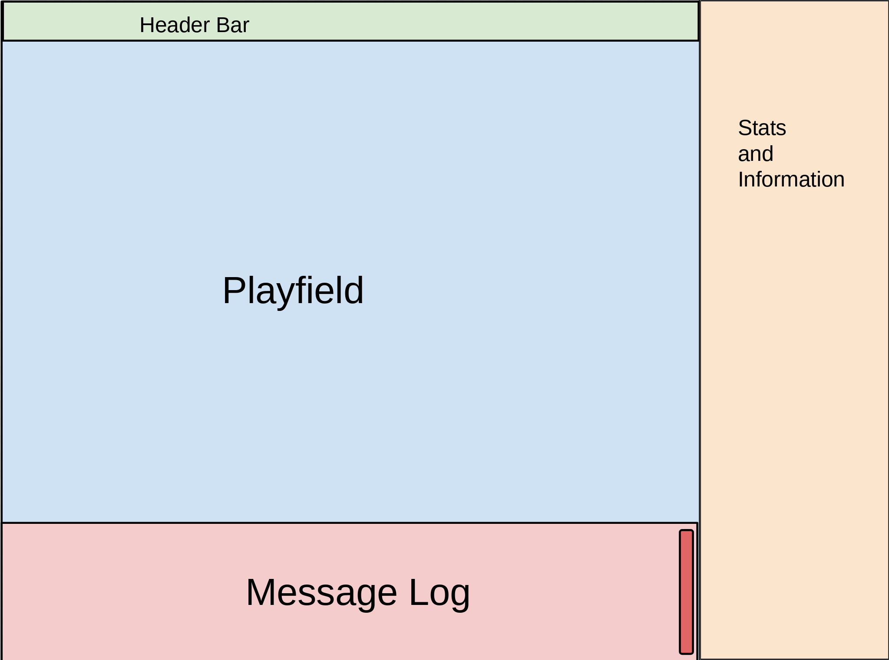

# Game UI

* Author: Douglas P. Fields, Jr. - symbolics@lisp.engineer
* License: [Apache License 2.0](https://www.apache.org/licenses/LICENSE-2.0)
* Created: 2026-06-11
* Last updated: 2026-06-11

This describes the UI for the game.

# Main Screen

The main UI is separated into four different areas,
of two different types:

* Playfield
* Header
* Message log
* Stats & information

## Playfield

The playfield is a fully graphical area which displays the
player, the map, the monsters, etc. It can be scaled separately
from the other areas, and scrolled and moved independently.

## Data Areas: Header, Message Log, Stats & Information

These three areas always take up the same portion of the screen
(exact portion to be determined). They can also be scaled
independently of the playfield scaling. They primarily have textual
information, but may also have simple graphs depctions (like bar graphs of health)
or iconography, such as for items or monsters, or for clickable controls.

Zooming in these areas will change the size of the text and other data
displayed in these areas, but will not change the portion of the screen that
each area takes up. It may be possible to resize the window and change the
zoom in a manner such as to make some data in these areas unreadable or
otherwise obscured.

### Message Log

* Scroll bar
  * Always scrolls to the bottom upon new text
* `[More]` prompts when too much text comes up between player
  actions
* Expandable - you can click a button or press a hotkey to expand the
  message log to cover the entire playfield.
  * Automatically contracts back down upon player action

### Header

TODO

### Stats and Information

TODO

# Changing the UI

## Resizing the Window

Resizing the window will scale the zoom proportionally, assuming the
window size changes in aspect ratio equally. If the aspect ratio
changes, the zoom will be adjusted according to the smaller portion
of the aspect ratio.

(NOTE: Test how this works to decide if it is a good mechanism.)

What this means is as the window gets smaller, the displayed information
scales smaller as well, making it possible to see the same amount of
information but at smaller pixel sizes.

## Zooming

There are 3 things that can be zoomed:
* Everything
* Just the Playfield
* Just the Data Areas

# Detail Screens

Some player actions will require additional details, e.g.,
viewing theh details of an item or a monster, managing inventory,
etc.

This will put an overlay that covers most of the screen except for
a small amount on the edges. This overlay will use the same zoom
settings as the Data Areas.

Each type of overlay will look generally similar, but will have a
different border color (a roundrect) and/or slight background color
to offer a visual affordance of which overlay is visible.

All detail screens can be dismissed by hitting a close button in the corner
or hitting the `ESC` key.